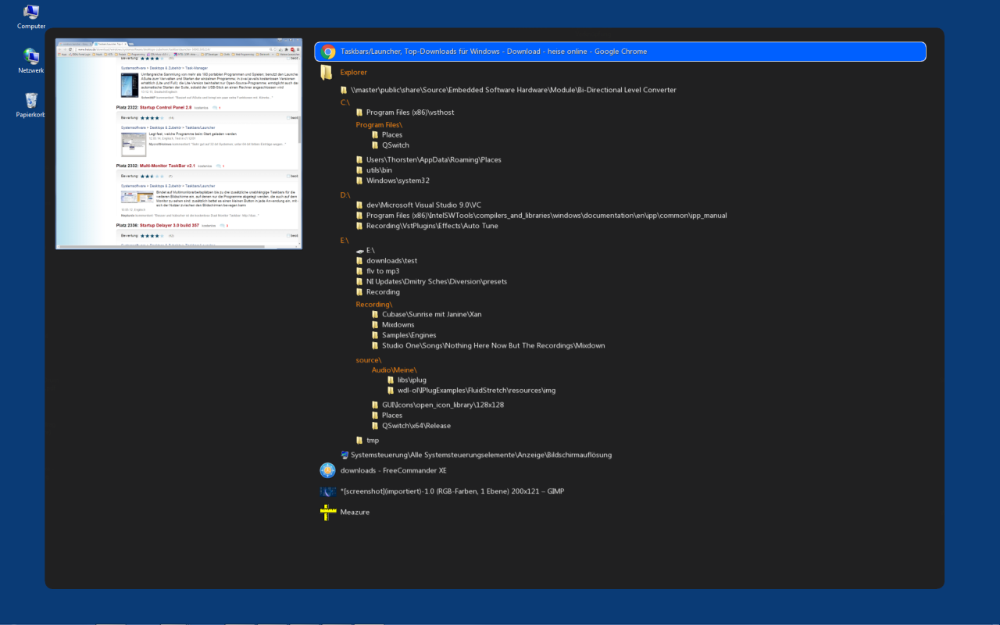

# QSwitch: Windows Task Switcher

## Design Goals
Locate and switch to any open window as fast as possible.

 - Open windows are sorted alphabetically by their process names.
 - On a second level, open windows are sorted alphabetically by their titles.
 - On successive levels, the backslash "\" within Window titles is used to group windows hierarchically. This way, especially windows which belong to Explorer can be located very fast.
	  
## Filtering
Using a special key (which can be user-defined), only windows of the current foreground process
are displayed. The filtered view is also shown, if the user-defined mouse-button is double-clicked.

## System Requirements
 - Windows Vista or higher
 - Graphics Card with OpenGL driver (i.e. any modern Graphics Card)

## Download
Download the binary installer at [www.idealsoftware.com](https://www.idealsoftware.com/opensource/qswitch.html).

## Links
[Youtube Video](https://youtu.be/-GtQ77A5sbY)
